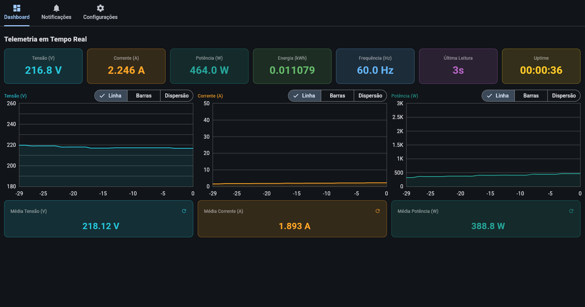

# EN. TEL — Sistema de Telemetria de Energia

Sistema de monitoramento de grandezas elétricas baseado em IoT. Coleta dados do
medidor de energia DDS238-2 ZN/S via Modbus RTU, transmite via LoRaWAN (TTN),
armazena no InfluxDB e exibe em um dashboard Flet com alertas por e-mail.

---

## Dashboard



<!-- Substitua docs/dashboard.png por um print real da aplicação em execução -->

---

## Arquitetura

```
DDS238-2 ZN/S
     |  RS485 / Modbus RTU
ESP32 + Módulo LoRaWAN (Radioenge RD49C)
     |  LoRaWAN OTAA (AU915)
TTN (The Things Network)
     |  MQTT
Telegraf  -->  InfluxDB 2.7
                    |
             Dashboard Flet
             Alarm Monitor (e-mail)
```

### Payload LoRaWAN (14 bytes, little-endian)

| Bytes | Tipo   | Grandeza          | Escala |
| ----- | ------ | ----------------- | ------ |
| 0–3   | uint32 | Energia (kWh)     | × 1000 |
| 4–5   | uint16 | Tensão (V)        | × 10   |
| 6–7   | uint16 | Corrente (A)      | × 1000 |
| 8–9   | int16  | Potência (W)      | —      |
| 10–11 | uint16 | Frequência (Hz)   | × 100  |
| 12–13 | uint16 | Fator de Potência | × 1000 |

---

## Hardware

| Componente         | Modelo / Part Number   | Função                         |
| ------------------ | ---------------------- | ------------------------------ |
| Microcontrolador   | ESP32-WROOM-32         | Aquisição e transmissão        |
| Medidor de energia | DDS238-2 ZN/S (Hiking) | Medição AC (até 65A)           |
| Módulo LoRaWAN     | Radioenge RD49C        | Transmissão de longa distância |
| Conversor RS485    | Módulo TTL/RS485       | Interface serial com o medidor |

**Pinagem ESP32:**

| Função       | GPIO |
| ------------ | ---- |
| RS485 RX     | 5    |
| RS485 TX     | 4    |
| LoRa UART RX | 16   |
| LoRa UART TX | 17   |

---

## Configuração

### 1. Variáveis de ambiente

Crie o arquivo `.env` na raiz do projeto:

```env
INFLUXDB_USERNAME=admin
INFLUXDB_PASSWORD=<senha>
INFLUXDB_ORG=entel
INFLUXDB_BUCKET=telemetry
INFLUXDB_TOKEN=<token>

SMTP_USER=<email@gmail.com>
SMTP_PASS=<senha-de-app-gmail>
```

### 2. Firmware ESP32

Edite `esp/esp.ino` com as credenciais OTAA do dispositivo registrado no TTN:

```cpp
const char* DEV_EUI = "...";
const char* APP_EUI = "...";
const char* APP_KEY = "...";
```

Compile com Arduino IDE. Bibliotecas necessárias:

- **ModbusMaster** (Doc Walker)

### 3. TTN

No console do TTN, registre o dispositivo com ativação OTAA e aplique o seguinte
formatter de payload (JavaScript) na aplicação:

```js
function decodeUplink(input) {
    var b = input.bytes;
    var e = (b[0] | b[1] << 8 | b[2] << 16 | b[3] << 24) / 1000.0;
    var v = (b[4] | b[5] << 8) / 10.0;
    var i = (b[6] | b[7] << 8) / 1000.0;
    var p = b[8] | b[9] << 8 << 16 >> 16;
    var f = (b[10] | b[11] << 8) / 100.0;
    var fp = (b[12] | b[13] << 8) / 1000.0;
    return {
        data: {
            energia_kwh: e,
            tensao_v: v,
            corrente_a: i,
            potencia_w: p,
            freq_hz: f,
            fp: fp,
        },
    };
}
```

Configure a integração MQTT do TTN apontando para o Telegraf.

### 4. Telegraf

O Telegraf deve estar configurado como `mqtt_consumer` gravando na measurement
`mqtt_consumer` do InfluxDB. Os campos chegam com o prefixo
`uplink_message_decoded_payload_`.

### 5. Serviços Docker

```bash
docker compose up -d
```

Sobe o InfluxDB e o alarm-monitor.

### 6. Dashboard

```bash
./run_dashboard.sh
```

Ou manualmente:

```bash
cd entel-dashboard
source .venv/bin/activate
python main.py
```

---

## Dashboard — Funcionalidades

- Autenticação com perfis de operador e administrador
- Cards em tempo real: Tensão, Corrente, Potência, Energia, Frequência, Última
  Leitura, Uptime
- Gráficos de linha, barras e dispersão com seletor por grandeza (Tensão,
  Corrente, Potência)
- Médias acumuladas com reset individual
- Alarmes visuais de sobretensão e subtensão com banner e silenciamento
- Notificações persistentes com data/hora (`yyyy/mm/dd hh:mm:ss`)
- Configurações de limites de tensão, histerese e intervalo de leitura (admin)
- Notificações por e-mail configuráveis por usuário
- Tema claro/escuro

---

## Alarm Monitor

Serviço Docker independente que consulta o InfluxDB a cada segundo e envia
e-mail quando a tensão ultrapassa os limites configurados. Suporta histerese e
cooldown entre notificações repetidas.

---

## Teste BLE

`test_ble/test_ble.ino` permite testar o medidor sem gateway LoRaWAN. Transmite
as leituras via BLE (perfil HM-10, UUID `FFE0`/`FFE1`) a cada 3 segundos. Use o
app **Serial Bluetooth Terminal** (Android) conectando ao dispositivo
`ENTEL-test`.

---

## Simulador

Para testar o pipeline sem hardware:

```bash
./run_simulate.sh
```

Envia dados simulados diretamente ao InfluxDB, reproduzindo o formato que o
Telegraf gravaria a partir do TTN.
